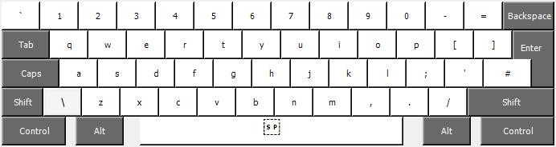
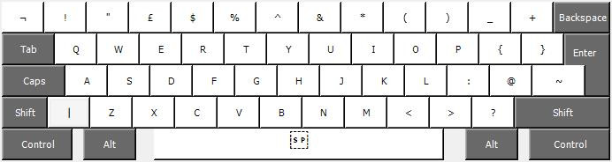
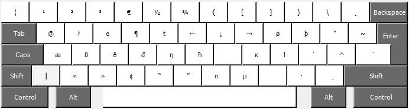
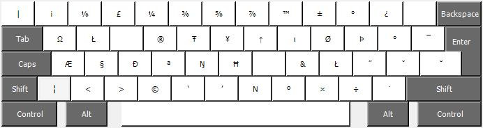

# Windows personal keyboard layout

Based on the Ubuntu **English (UK)** keyboard layout.

Sometimes I need to work on Windows and the default keyboard layouts are not very convenient when you want to write with accents. 

## How to use

1. Download and install [Microsoft Keyboard Layout Creator](https://www.microsoft.com/en-us/download/details.aspx?id=102134).
2. Load *iso-custom-keyboard-layout.klc* or *ansi-custom-keyboard-layout.klc*: `File > Load Source File`.
3. Build the project: `Project > Build DLL and Setup Package`.
4. Run the genarated `.exe` file to install the layout.
5. Then change your keyboard layout in the `Language preferences` section.

## ISO Layout

### Base

### Shift

### AltGr

### Shift + AltGr

## ANSI Layout

ANSI layout is pretty much the same with the classic differences.
